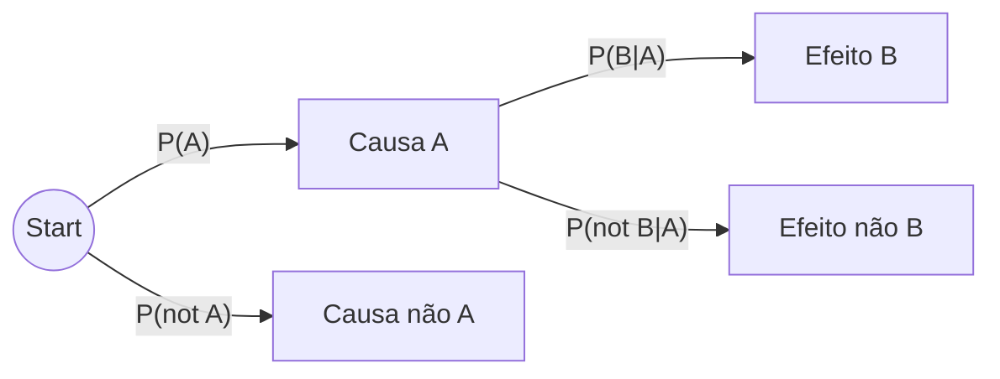

## 1. Definições e Mnemónicas Fundamentais

A **probabilidade condicional** $P(A|B)$ é a probabilidade de ocorrência de um acontecimento $A$ quando se admite que ocorreu um acontecimento $B$.

- **Mnemónica de Interpretação:**
    
    > $P( \text{O que eu quero calcular} \mid \text{O que eu já sei antes} ) = \frac{P(\text{Interseção das duas})}{P(\text{O que eu já sei antes})}$
    
- **Fórmula Axiomática:** $$P(A|B) = \frac{P(A \cap B)}{P(B)}, \text{ com } P(B) > 0$$

- **Interseção ($A \cap B$):** Acontecimento "$A$ **e** $B$".
    - Eventos Dependentes: $P(A \cap B) = P(A|B) \cdot P(B)$.
    - Eventos Independentes: $P(A \cap B) = P(A) \cdot P(B)$.

---

## 2. Metodologia de Resolução (O "Ritual")

1. **Definir Variáveis/Acontecimentos:** Ex: Seja $S$: "O e-mail é spam"; $B$: "O e-mail foi bloqueado".
2. **Extrair Dados:** Identificar as probabilidades _a priori_ ($P(A)$) e as _condicionais_ ($P(B|A)$).
3. **Verificar Pressupostos:** Os acontecimentos são independentes? São uma partição (exaustivos e exclusivos)?.
4. **Executar o Cálculo:** Via Tabela ou Árvore.
5. **Conclusão no Contexto:** Responder à pergunta original de forma escrita.

---

## 3. Ferramenta A: Tabela de Cruzamento (Preferencial)

Ideal para visualizar a interseção e a probabilidade total rapidamente.

## 3. Ferramenta A: Tabela de Cruzamento (Preferencial)

Ideal para visualizar a interseção e a probabilidade total rapidamente.

| | $B$ (Sabe-se) | $\bar{B}$ (Não $B$) | **Total (Marginal)** |
| :--- | :---: | :---: | :---: |
| **$A$ (Quer-se)** | $P(A \cap B)$ | $P(A \cap \bar{B})$ | $P(A)$ |
| **$\bar{A}$** | $P(\bar{A} \cap B)$ | $P(\bar{A} \cap \bar{B})$ | $P(\bar{A})$ |
| **Total** | $P(B)$ | $P(\bar{B})$ | **1.000** |

- **Como usar:** Se o problema diz "Sabendo que $B$ ocorreu...", você foca apenas na **Coluna $B$**.
- **Cálculo:** $P(A|B) = \frac{\text{Célula }(A \cap B)}{\text{Total da Coluna } B}$.

---

## 4. Ferramenta B: Árvore de Resultados (Causalidade)

Ideal quando o problema descreve um processo sequencial ou de diagnóstico.

**Regra de Ordem na Árvore:**

- **1º Nível (Ramos de Origem):** A **Causa** ou o acontecimento incondicional ($P(A)$). Sempre o que acontece primeiro no tempo ou na lógica.
- **2º Nível (Ramos Secundários):** O **Efeito** ou o resultado do teste ($P(B|A)$). Estas são sempre probabilidades condicionais.

**Exemplo (Problema 3.8):**

- **1º:** Máquinas (A, B, C) → São a causa.
- **2º:** Peça ser Defeituosa ($D$) ou Boa ($ND$) → É o efeito condicionado à máquina.
- **Regra de Cálculo:** Multiplica-se ao longo dos ramos para obter a interseção; soma-se as pontas finais para obter a probabilidade total do efeito.

---

## 5. Exercícios de Revisão (Casos Reais)

### Exercícios Estruturantes (Livro/Slides)

- **Problema 3.7 (Barómetro):** Treina a árvore com probabilidades de Sol/Chuva e erros de previsão.
- **Problema 3.8 (Máquinas A, B, C):** O exemplo clássico do Teorema de Bayes para descobrir de qual máquina veio a peça defeituosa.
- **Problema 3.9 (Acidente Aéreo):** Diagnóstico de falha estrutural vs. não-estrutural.

### Problemas de Exame Recentes

- **Exame 2024-2025 (Questão 1):** Probabilidade de doença cardíaca condicionada ao histórico familiar (5 valores).
- **Exame 2020-2021 (Questão 1):** Internamentos DGS (Norte/Sul e Gravidade). Exige lidar com partições da população.
- **Modelo 2025-2026 (Questão 1):** Probabilidade de causa de morte baseada em antecedentes genéticos.

> **Lembrete de Prova:** O **Teorema de Bayes** é simplesmente a aplicação da probabilidade condicional para "inverter" a árvore: você conhece o efeito ($B$) e quer saber a probabilidade da causa ($A_i$).

